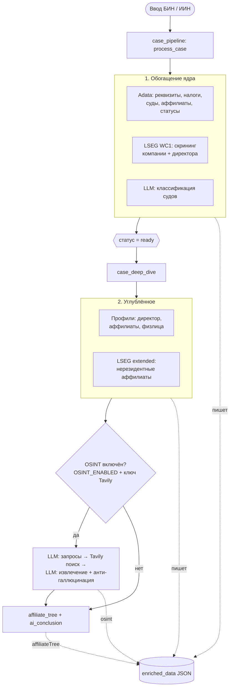
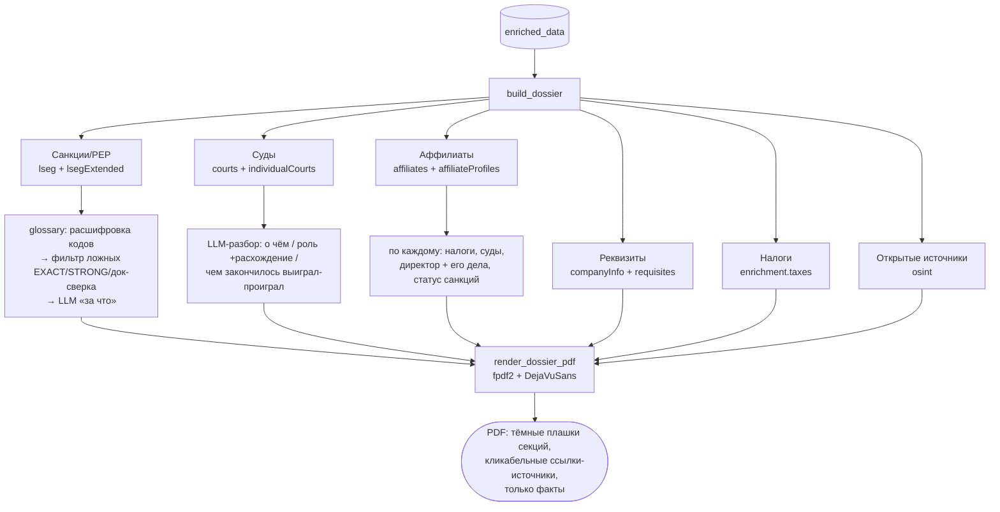

# Akashi Compliance

Compliance workspace: загрузка Excel, проверка контрагентов через провайдеры данных (Adata + заглушки), заключение ИИ и React UI.

## Архитектура MVP

- **FastAPI** (`app/`) — cases API, legacy audits API для Streamlit
- **Provider interface** — Adata, Stub, заготовка Kompra; при недоступности API — детерминированные stub-данные
- **SQLite** — дела, документы, чат, история audits
- **Next.js** (`frontend/`) — основной UI

## Как формируется досье

Два этапа: **сбор данных** (БИН → `enriched_data`) и **сборка PDF-досье** (`enriched_data` → PDF).
Всё хранится в одном JSON-блобе `cases.enriched_data`. Принцип — **только факты**, без оценок и
рекомендаций; аббревиатуры расшифровываются в простой русский.

### Этап A — сбор данных (фоновая цепочка задач)



> OSINT идёт **после** deep-dive: ему нужны имена из обогащения и дедуп против LSEG/Adata.
> Цепочку ведёт **TaskIQ-воркер** — при смене `.env` (ключи) перезапускать нужно **и API, и воркер**.

### Этап B — сборка PDF (`GET /cases/{id}/dossier.pdf`)

Детерминированно из `enriched_data` + 2 LLM-вызова на читаемость.



**Источники:** Adata (реквизиты/налоги/суды/аффилиаты), LSEG World-Check One (санкции/PEP/медиа),
Tavily+LLM (OSINT — открытые источники). LLM используется точечно: классификация судов,
«за что» по санкциям, разбор дел, извлечение OSINT.

## Переменные окружения

Скопируйте `.env.example` в `.env` и при необходимости задайте `ADATA_TOKEN`, `OPENAI_API_KEY`.

Без ключей всё работает на заглушках (`sources: ["stub"]` в `/api/providers`).

### Adata (контрагент)

Основной источник — единый **company info** (`GET …/info/{token}?iinBin=…` → poll `…/info/check/{token}?token=…`).
Отдельные эндпоинты (`basic`, `riskfactor`, `trustworthy-extended`, `relation`, `courtcase`) вызываются
только если нужного поля нет в ответе `info`. Сырой блок сохраняется в `company_data.raw["info"]`.
Подробнее: `app/services/adata/client.py`.

## Установка и запуск

### Очередь задач (TaskIQ + Redis)

Тяжёлые операции (проверка Adata, дерево связей) выполняются **в отдельном worker-процессе**, API сразу отвечает клиенту.

```bash
# 1. Redis
docker run -d --name akashi-redis -p 6379:6379 redis:7-alpine

# 2. API (терминал 1)
uv sync
uv run python main.py

# 3. Worker (терминал 2)
uv run akashicompliance-worker
```

Или всё сразу: `docker compose up --build` (сервисы `api`, `worker`, `redis`, `postgres`, `frontend`).

**Docker (production):** с хоста наружу только **frontend `8000`**; API без `ports`. Nginx на reverse-proxy: `proxy_pass http://APP_SERVER:8000`. API для браузера — через `/backend-api` (rewrite Next → `http://api:8000`). См. `.env.example` (секция Docker Compose).

Переменные: `REDIS_URL`, `TASK_QUEUE_ENABLED=true`. Без Redis, без worker или с `TASK_QUEUE_ENABLED=false` — fallback на `asyncio` в процессе API (как раньше). `GET /health` показывает `workerOk`, `activeBackend` и `warning`, если worker не запущен.

Проверка: `GET /health` → `queue.redisOk`, `queue.workerOk`, `queue.activeBackend` (в Docker снаружи: `https://your-host/backend-api/health`).

### Backend

```bash
uv sync
uv run python main.py
```

Проверка импорта:

```bash
uv run python -c "from app.api import app"
```

### Frontend

```bash
cd frontend
npm install
npm run dev
```

Откройте http://localhost:3000 — UI ходит на `NEXT_PUBLIC_API_URL` (по умолчанию http://127.0.0.1:8000).

### Streamlit (legacy)

```bash
uv run streamlit run streamlit_app.py
```

## API

### Cases (основной UI)

| Method | Path | Описание |
|--------|------|----------|
| POST | `/api/upload` | JSON `{cases: [{name, iinBin}]}` или multipart Excel |
| GET | `/api/cases` | Список дел |
| GET | `/api/cases/{id}` | Полное дело |
| GET | `/api/cases/{id}/graph` | Граф связей |
| GET | `/api/cases/{id}/conclusion` | Текст заключения |
| POST | `/api/cases/{id}/chat` | Чат |
| POST | `/api/cases/{id}/documents` | Метаданные документа |
| GET | `/api/providers` | Статус провайдеров |
| GET | `/health` | Health check |

### Audits (Streamlit)

- `POST /api/audits/run`
- `GET /api/audits/history`
- `GET /api/audits/{id}`
- `GET /api/audits/{id}/pdf`

## Очереди

| Задача | TaskIQ name | Описание |
|--------|-------------|----------|
| `case_pipeline` | `case_pipeline` | Обогащение Adata; затем отдельно `affiliate_tree` и `ai_conclusion` |
| `affiliate_tree` | `affiliate_tree` | Построение дерева связей (глубина 2) |
| `ai_conclusion` | `ai_conclusion` | ИИ-заключение по готовому досье |
| `chat_reply` | `chat_reply` | Ответ ИИ в чате по делу |

## Phase 2 (не в MVP)

PostgreSQL, Celery, Redis, Neo4j, Kompra/egov провайдеры, SSE-чат, авторизация.
